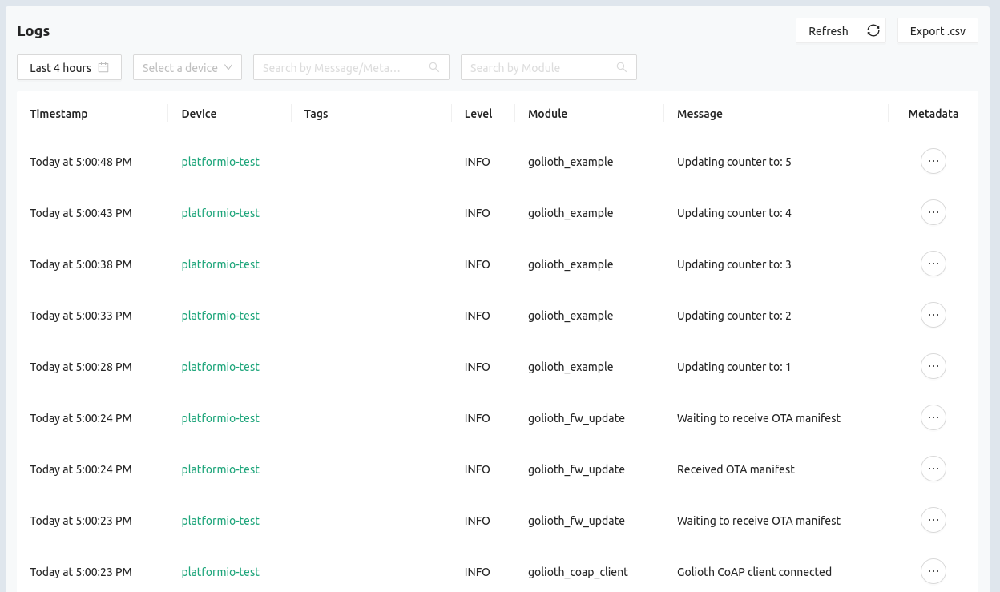
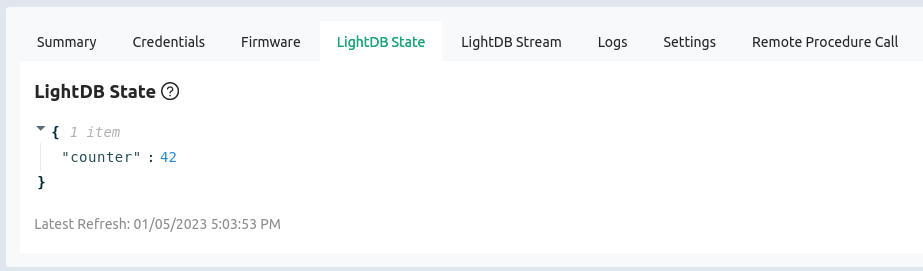

# Golioth PlatformIO/Arduino Demo

This project allows you to use [Golioth device management](https://golioth.io/)
with an ESP32-based Arduino project.

The repository is a [PlatformIO](https://platformio.org/) project for the ESP32
family of chips. It uses the Espressif platform and includes both the Arduino
SDK and the Golioth SDK. This means that basic Arduino code, and some Arduino
libraries, will work alongside
[ESP-IDF](https://www.espressif.com/en/products/sdks/esp-idf) and Golioth
functionality.

**Note:** As with all GoliothLabs repositories, this is an experimental project.
If you are building an IoT device based on the ESP32 family of chips, you should
not use this. You should instead use the [Golioth Firmware
SDK](https://github.com/golioth/golioth-firmware-sdk) which includes top-tier
support for ESP-IDF.

## What is this all about?

We have had some customers who are migrating from Arduino-based ecosystems over
to ESP32. To help in that transition, we put together this demonstration that
represents an intermediary step. Their Arduino-centric codebase can be tested
with this repository as a starting point.

PlatformIO controls the build system. Under the hood this project uses ESP-IDF,
including the Arduino SDK as a component.

## Installation

Prerequisite: [Install PlatformIO for
VScode](https://docs.platformio.org/en/latest/integration/ide/vscode.html)

1. Clone this repo to a folder where you like to keep your PlatformIO projects

   ```shell
   git clone https://github.com/goliothlabs/golioth_platformio_arduino.git
   ```

2. Enter the folder and run the following commands:

   ```shell
   cd golioth_platformio_arduino
   git submodule update --init --recursive
   git clone https://github.com/hathach/tinyusb.git third_party/esp32-arduino-lib-builder/components/arduino_tinyusb/tinyusb
   ```

   **Note:** The `tinyusb` package needs to be added in the components directory of the
   ESP32 Arduino Lib Builder. Because the Lib Builder is already a submodule, we're
   directly cloning tinyusb into it. This is not ideal but it works. A more robust
   solution would be to clone those elsewhere (not as submodules) and update the
   CMakeLists.txt entry for tinyusb.

3. Import the project in PlatformIO

## Building the demo

This demo targets the ESP32. If you want to use a different chip (eg: ESP32-s2,
ESP32-c3) the change needs to be made in the PlatformIO.

1. Make a copy of `credentials.h_example` and rename it `credentials.h`. In this
   file you need to provide four credentials for this demo to run:

   * WiFi SSID
   * WiFi Password
   * Golioth Device PSK-ID
   * Golioth Device PSK

   **Note:** You can find your device credentials by visiting the [Golioth Web
    Console](https://console.golioth.io/).

2. Use PlatformIO to build the project and upload it to your ESP32. Use the
   monitor feature to see the output from the serial terminal as the program
   runs:

   ```shell
   I (927) wifi:Set ps type: 1

   I (939) wifi:new:<6,0>, old:<1,0>, ap:<255,255>, sta:<6,0>, prof:1
   I (941) wifi:state: init -> auth (b0)
   I (946) wifi:state: auth -> assoc (0)
   I (951) wifi:state: assoc -> run (10)
   I (963) wifi:connected with YourWiFiSSID, aid = 1, channel 6, BW20, bssid = c6:ff:d4:a8:fa:10
   I (964) wifi:security: WPA2-PSK, phy: bgn, rssi: -41
   I (972) wifi:pm start, type: 1

   I (1019) wifi:AP's beacon interval = 102400 us, DTIM period = 2
   .I (1724) esp_netif_handlers: sta ip: 192.168.1.157, mask: 255.255.255.0, gw: 192.168.1.1
   .IP address:
   192.168.1.157
   I (1934) golioth_mbox: Mbox created, bufsize: 2184, num_items: 20, item_size: 104
   I (1936) golioth_fw_update: Current firmware version: 1.0.1
   Hello, GoliW (1947) wifi:<ba-add>idx:0 (ifx:0, c6:ff:d4:a8:fa:10), tid:0, ssn:1, winSize:64
   oth! #0
   I (1958) golioth_example: Updating counter to: 0
   I (1960) golioth_coap_client: Start CoAP session with host: coaps://coap.golioth.io
   I (1963) golioth_coap_client: Session PSK-ID: your-device-name@your-golioth-project
   I (1976) libcoap: Setting PSK key

   I (1983) golioth_coap_client: Entering CoAP I/O loop
   I (2313) golioth_coap_client: Golioth CoAP client connected
   I (2374) golioth_fw_update: Waiting to receive OTA manifest
   I (3493) golioth_fw_update: Received OTA manifest
   I (3495) golioth_fw_update: Manifest does not contain different firmware version. Nothing to do.
   I (3499) golioth_fw_update: Waiting to receive OTA manifest
   Hello, Golioth! #1
   I (6989) golioth_example: Updating counter to: 1
   Hello, Golioth! #2
   I (11996) golioth_example: Updating counter to: 2
   Hello, Golioth! #3
   I (17004) golioth_example: Updating counter to: 3
   Hello, Golioth! #4
   ```

3. You can see three distinct stages in the output above:

   1. Device connects to WiFi access point and acquires IP address
   2. Device connects to Golioth and checks for firmware updates
   3. Program begins running
      1. Arduino Serial used to print "Hello, Golioth! #n" to the terminal
      2. Golioth Logging subsystem sends log messages to the cloud (and prints them
         in the terminal)

## Working with Golioth Features

This example code illustrates three of the Golioth features:

* Over the Air (OTA) firmware update
* Logging
* LightDB State

**NOTE:** The remaining Golioth features (like the Settings Service, Remote
Procedure Call (RPC), LightDB Stream, etc) are available but not implemented in
this example. Please see [the Golioth Basics example
code](https://github.com/golioth/golioth-firmware-sdk/blob/main/examples/common/golioth_basics.c)
for more information on how to use these features.

### Over the Air (OTA) firmware update

1. Build and upload the demo to your device.
2. Update the `_current_version` number in `src/main.cpp` to `1.0.1`
3. Rebuild the firmware but do not upload it to the device
4. Log into the [Golioth Console](https://console.golioth.io)
   1. Create a firmware artifact using 1.0.1 as the revision number and upload
      the `firmware.bin` found in the `.pio/build/esp32dev` folder.
   2. Create a release on Golioth using the artifact from the previous step.
   3. Roll out the new release and the device will immediately detect the
      new version.

**Note:** For more information on uploading firmware to Golioth, please [see the upload
section](https://blog.golioth.io/how-to-do-esp32-ota-updates-using-golioth-and-esp-idf/#upload-to-golioth)
of our post on ESP32 OTA.

```shell
Hello, Golioth! #240
I (1203818) golioth_example: Updating counter to: 240
I (1203828) golioth_fw_update: Received OTA manifest
I (1203829) golioth_fw_update: Current version = 1.0.0, Target version = 1.0.1
I (1203831) golioth_fw_update: State = Downloading
I (1204319) golioth_fw_update: Image size = 1002768
I (1204321) golioth_fw_update: Getting block index 0 (1/980)
I (1204685) fw_update_esp_idf: Writing to partition subtype 17 at offset 0x1a0000
I (1204687) fw_update_esp_idf: Erasing flash
Hello, Golioth! #241
I (1208932) golioth_example: Updating counter to: 241
I (1209519) golioth_fw_update: Getting block index 1 (2/980)
I (1209664) golioth_fw_update: Getting block index 2 (3/980)
I (1209766) golioth_fw_update: Getting block index 3 (4/980)
I (1209878) golioth_fw_update: Getting block index 4 (5/980)
I (1209986) golioth_fw_update: Getting block index 5 (6/980)
I (1210089) golioth_fw_update: Getting block index 6 (7/980)
I (1210192) golioth_fw_update: Getting block index 7 (8/980)
I (1211080) golioth_fw_update: Getting block index 8 (9/980)
I (1211186) golioth_fw_update: Getting block index 9 (10/980)
I (1211291) golioth_fw_update: Getting block index 10 (11/980)
I (1212112) golioth_fw_update: Getting block index 11 (12/980)
...
```

### Logging

Log messages can be sent to the Golioth servers. This feature is enabled by the
`CONFIG_GOLIOTH_AUTO_LOG_TO_CLOUD=1` present in the `sdkconfig.defaults` file.
Any messages generated using the `GLTH_LOGX()` macros will appear in the
Monitor&rarr;Logs section of the [Golioth Console](https://console.golioth.io):



### LightDB State

The counter value in the loop of the demo program is being reported to the
server using Golioth LightDB State. This value can be viewed in the [Golioth
Console](https://console.golioth.io) by navigating to the Devices page,
selecting your device, then selecting the LightDB State tab:



## Troubleshooting

### Regenerating the sdkconfig settings

The project-specific configuration for the ESP-IDF build process is located in
the `sdkconfig.defaults` file. When changes are made to this file, the
`sdkconfig.esp32dev` should be deleted, forcing CMake to regenerate it with the
new default settings.

### Partition Table

PlatformIO settings override sdkconfig settings for the partition table. This is
a notable and surprising difference for those accustomed to using the ESP-IDF.

* [PlatformIO Docs: partition
  tables](https://docs.platformio.org/en/latest/platforms/espressif32.html#partition-tables)
